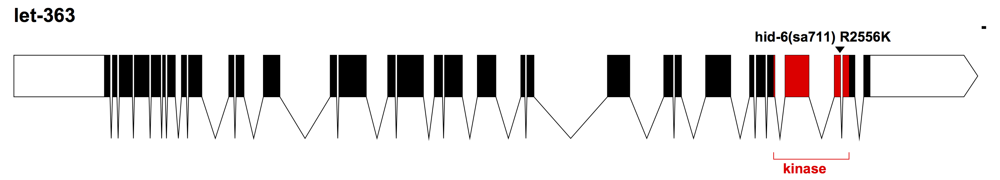
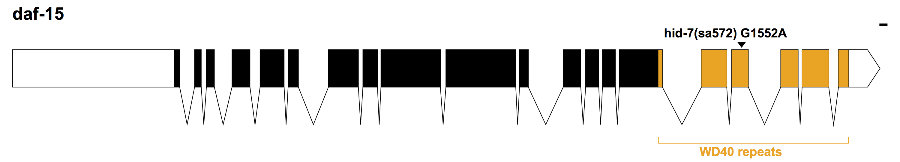

```{r setup, include=FALSE}
knitr::opts_chunk$set(echo = TRUE)
knitr::opts_chunk$set(message = FALSE)
knitr::opts_chunk$set(warning = FALSE)
# library(knitr)
# library(ggplot2)
# library(plotly)
# library(ggbeeswarm)
# library(beeswarm)
# library(ggthemes)
# library(viridis)
# library(lme4)
# #library(pbkrtest)
# library(schoRsch)
# library(DHARMa)
# library(multcomp)
# library(magrittr)
# library(tidyr)
# library(dplyr)
# library(ggrepel)

#pathname='/Users/mikeod/Dropbox/Temp_shareDocs/Dauer/rict-1_paper/Int_state_paper'
pathname = getwd()
###some functions:

#alt to theme classic
theme_my_classic <- theme_classic() +
  theme(axis.text.x=element_text(angle=45, hjust=1, size=12),legend.key = element_blank())

#plotting theme I use for most plots
 theme_my <- theme_bw() + theme(
   axis.line        = element_line(colour = "black"),
   panel.grid.major = element_blank(), 
   panel.grid.minor = element_blank(),
   panel.border     = element_blank(),
   strip.background = element_blank(),
   legend.key       = element_blank(), 
   axis.text.x=element_text(angle=45, hjust=1, size=12)
 )

#  
# 
# box_annot<-function(x) {
#   # text annotation of plots
#   return(data.frame(y=max(x) + 0.05 + 0.1*max(x)))
# }
# # 
# fun_length<-function (x) {
#   # annotate plot with sample size
#   return(data.frame(y=min(x), label = paste0("n=", length(x))))
# }
# 
# overdisp_fun <- function(model) {
#   ## number of variance parameters in 
#   ##   an n-by-n variance-covariance matrix
#   vpars <- function(m) {
#     nrow(m)*(nrow(m)+1)/2
#   }
#   model.df <- sum(sapply(VarCorr(model),vpars))+length(fixef(model))
#   rdf <- nrow(model.frame(model))-model.df
#   rp <- residuals(model,type="pearson")
#   Pearson.chisq <- sum(rp^2)
#   prat <- Pearson.chisq/rdf
#   pval <- pchisq(Pearson.chisq, df=rdf, lower.tail=FALSE)
#   c(chisq=Pearson.chisq,ratio=prat,rdf=rdf,p=pval)
# }
# 
# tukey_contrasts<-function(x, factor) {
#   #get post-hoc pairwise Tukey comparisons
#   library(lsmeans)
#   x.rg<-ref.grid(x, type = "response")
#   contrasts<-x.rg %>% lsmeans(factor) %>% pairs(adjust = "mvt") %>% summary() %>% prange()
#   return(contrasts)
# }
# 
# dunnett_contrasts<-function(x, ref.index, factor, interaction) {
#   #generates Dunnett contrasts for a given level of factor (use quotes for factor = ""), adjustment 
#   library(lsmeans)
#   x.rg <- ref.grid(x, type="response")
#   contrasts.1<-x.rg %>% lsmeans(factor) %>% contrast("trt.vs.ctrl", ref = ref.index) %>% summary(adjust = "mvt") %>%
#     prange()
#   if(missing(interaction)) {
#     print("interaction term not indicated")
#     return(contrasts.1)
#   } else {
#     contrasts.2<- x.rg %>% lsmeans(interaction, by = factor) %>% pairs(by = factor) %>%
#       summary(adjust = "mvt", by=NULL) %>% prange()
#     return(list(factor = contrasts.1, interaction = contrasts.2))
#   }
# }
# 
# MM_CI_trans_Tukey<-function(y,strains) {
#   # get confidence intervals for glm on original response scale - tukey comparisons
#   library(lsmeans)
#   y.rg<-ref.grid(y, type="response")
#   y.lsm<-lsmeans(y, "genotype")
#   y.lsm.sum<-summary(y.lsm,level = .95, infer=TRUE, adjust = "Tukey", type="response")
#   colnames(y.lsm.sum)<-c("genotype","mean", "SE", "df", "lower.CL", "upper.CL", "z.ratio", "p.value")
#   mixed<-with(y.lsm.sum,data.frame(mean,lower.CL, upper.CL,SE))
#   mixed<-cbind(strains,mixed)
#   mixed$genotype<-factor(mixed$strains, levels = strains)
#   mixed$x.pos<-as.numeric(as.factor(mixed$genotype)) + 0.3
#   # colnames(mixed)<-c("strains", "mean", "lower.CL", "upper.CL", "genotype", "x.pos")
#   return(mixed)
# }
# 
# MM_CI_trans_dunnett<-function(y,strains) {
#   #get CIs and mean from glm dunnett comparisons
#   y.rg<-ref.grid(y, type="response")
#   y.lsm<-lsmeans(y.rg, "genotype")
#   y.lsm.sum<-summary(y.lsm,level = .95, infer=TRUE, adjust = "mvt", type="response")
#   colnames(y.lsm.sum)<-c("genotype","mean", "SE", "df", "lower.CL", "upper.CL", "z.ratio", "p.value")
#   mixed<-with(y.lsm.sum,data.frame(mean,lower.CL, upper.CL,SE))
#   mixed<-cbind(strains,mixed)
#   mixed$genotype<-factor(mixed$strains, levels = strains)
#   mixed$x.pos<-as.numeric(as.factor(mixed$genotype)) + 0.3
#   # colnames(mixed)<-c("strains", "prob", "lower.CL", "upper.CL", "genotype", "x.pos")
#   return(mixed)
# }
# 
# MM_CIs<-function(y,strains) {
#   # generate confidence intervals for linera models
#   library(lsmeans)
#   y.rg<-ref.grid(y)
#   y.lsm<-lsmeans(y, "genotype")
#   y.lsm.sum<-summary(y.lsm,level = .95, infer=TRUE, adjust = "Tukey")
#   mixed<-with(y.lsm.sum,data.frame(lsmean,lower.CL, upper.CL))
#   mixed<-cbind(strains,mixed)
#   mixed$genotype<-factor(mixed$strains, levels = strains)
#   mixed$x.pos<-as.numeric(as.factor(mixed$genotype)) + 0.3
#   colnames(mixed)<-c("strains", "mean", "lower.CL", "upper.CL", "genotype", "x.pos")
#   return(mixed)
# } 
# 
# #
# plot_CIs<-function (df, title, plot.contrasts, plot.contrasts.2, ypos, type, offset) {
#   #generate plots for different types of data
#   #all using genotype as predictor factor
#   #type = "dauer" or "grid" or "GFP" or mRNA expression plot
#   #set common values for all plots:
#   box.width <- 0.3
#   point.size <- 1
#   line.width <- 0.2
#   text.size <- 3
#   #genreate plot
#   p <- ggplot(df, aes(x=genotype)) + #x-layer
#     theme_my +
#     geom_point(data=mixed, aes(x=x.pos, y=mean), colour="blue", size=point.size) + #model mean
#     geom_errorbar(data=mixed, aes(x=x.pos,y=mean, ymin=lower.CL, ymax=upper.CL),
#                   width=.1,colour ="blue", lwd=line.width) + #95% confint
#     scale_x_discrete(labels=function(x) sub(" ","\n",x,fixed=TRUE)) +
#     stat_summary(aes(x=genotype, y=ypos), geom="text", label=plot.contrasts, show.legend = TRUE, size=text.size) + # pvalues
#     theme(axis.text.x = element_text(size = 16),
#           axis.text.y = element_text(size = 12),
#           axis.line = element_line(size=0.2),
#           axis.title = element_text(size=16))
#   if(type == "dauer") {
#     p1 <- p + 
#       geom_boxplot(aes(y=pct), width=box.width, outlier.shape=NA, lwd=line.width, fill="grey") +
#       geom_point(aes(y=pct),size=point.size-(0.7*point.size),alpha=0.75) + 
#       labs(title = title,
#            y = "proportion dauer",
#            x = "genotype"
#       ) +
#       scale_y_continuous(breaks=c(0,0.25,0.5,0.75, 1.0))
#     } else {#roaming plots
#       if(type == "grid") {
#         p1 <- p + geom_boxplot(aes(y=n_entries), width=box.width, outlier.shape=NA, lwd=line.width, fill = "#33CCFF") +
#         geom_point(aes(y=n_entries), size=point.size-(0.7*point.size),alpha=0.75) + 
#         labs(title = title,subtitle="roaming plot",y = "grid entries",x = "genotype")
#       } else {#GFP expression plots
#         if(type == "GFP") {
#         p1 <- p + geom_boxplot(aes(y=cell.norm),width=box.width, outlier.shape=NA, lwd=line.width, alpha = 0.75, fill="#339900") +
#         geom_quasirandom(aes(y=cell.norm),width = 0.05, method = 'smiley', size=point.size-(0.7*point.size),alpha=0.75, alpha = 0.75) + 
#         labs(title = title,subtitle="GFP plot",y = "normalized expression",x = "genotype")
#         } else {#mRNA plots
#         p1 <- p + geom_boxplot(aes(y=cell.norm),width=box.width, outlier.shape=NA, lwd=line.width, alpha = 0.75, fill="#990000") +
#         geom_quasirandom(aes(y=cell.norm),width = 0.05, method = 'smiley',size=point.size-(0.7*point.size),alpha=0.75, alpha = 0.75) + 
#         labs(title = title,subtitle ="mRNA FISH plot", y = "normalized expression",x = "genotype")
#         }
#       }
#     }
#   if(missing(plot.contrasts.2)) {
#     p1 + stat_summary(aes(x=as.numeric(as.factor(genotype)) + 0.3, y=0),
#                       fun.data = fun_length, geom = "text", size = 3)
#   } else { # add secondary comparisons
#     p1 + stat_summary(aes(x=genotype, y=ypos-offset), geom="text", label=plot.contrasts.2, size=text.size, colour="red") +
#       stat_summary(aes(x=as.numeric(as.factor(genotype)) + 0.3, y=0),
#               fun.data = fun_length, geom = "text", size = 3)
#   }
# }
# 
# plot_dauer_SEs<-function (df, title, plot.contrasts, plot.contrasts.2, ypos) {
#   p <- ggplot(df, aes(x=genotype, y=pct)) + geom_boxplot(width=0.3, outlier.shape=NA) + geom_point(cex=1,alpha = 0.5) + 
#     labs(title = title,
#          y = "proportion dauer",
#          x = "genotype"
#             ) +
#     theme_my + 
#     geom_point(data=mixed, aes(x=x.pos, y=mean), colour="blue") +
#     geom_errorbar(data=mixed, aes(x=x.pos,y=mean, ymin=mean-SE, ymax=mean+SE),
#               width=.1,colour ="blue") + 
#     scale_y_continuous(breaks=c(0,0.25,0.5,0.75, 1.0)) +
#     stat_summary(aes(x=genotype, y=ypos), geom="text", label=plot.contrasts, size=3, angle =45)
#   if(missing(plot.contrasts.2)) {
#         p
#     } else {
#         p + stat_summary(aes(x=genotype, y=ypos-0.075), geom="text", label=plot.contrasts.2, size=3, colour="red") +  + stat_summary(aes(x=as.numeric(as.factor(genotype)) + 0.3, y=min),
#               fun.data = fun_length, geom = "text", size = 3)
#     }
# }
# 
# plot_dauer_noCIs<-function (df, title, fillsig) {
#   if(missing(fillsig)) {
#       ggplot(df, aes(x=genotype, y=pct)) +
#       geom_boxplot(width=0.5) + geom_point(cex=1,alpha = 0.5) +
#       labs(title = title,
#            y = "proportion dauer",
#            x = "genotype"
#             ) + theme_my +
#       scale_y_continuous(breaks=c(0,0.25,0.5,0.75, 1.0))
#     } else {
#       ggplot(df, aes(x=genotype, y=pct)) +
#         geom_boxplot(width=0.5,fill = c("white", fillsig)) +
#         labs(title = title,
#            y = "proportion dauer",
#            x = "genotype"
#             ) + theme_my +
#       scale_y_continuous(breaks=c(0,0.25,0.5,0.75, 1.0))
#     }
# }
# 
# plot_regression_se<-function(df, meanX, meanY, semX, semY) {
#   library(ggrepel)
#   ySEmin = df[[meanY]]-df[[semY]]
#   ySEmax = df[[meanY]]+df[[semY]]
#   xSEmin = df[[meanX]]-df[[semX]]
#   xSEmax = df[[meanX]]+df[[semX]]
#   p <- ggplot(df, aes_string(x=meanX, y=meanY),environment = environment())
#   p + geom_point() + 
#     theme_my +
#     scale_color_viridis(option="plasma", end=0.9, direction = -1, name="absolute 
# latitude") + 
#     geom_errorbar(aes(ymin=ySEmin, ymax=ySEmax)) + 
#     geom_errorbarh(aes(xmin=xSEmin, xmax=xSEmax)) +
#     coord_cartesian(ylim = c(-.05, 1), xlim=c(-.05,1)) + 
#     geom_smooth(aes_string(x=meanX, y=meanY, group=1), method="lm", se=TRUE, alpha = 0.2) +
#     geom_text_repel(aes(label=genotype, colour=lat_abs),
#     box.padding = unit(0.35, "lines"),
#     point.padding = unit(0.5, "lines"),
#     segment.color = 'grey50'
#   ) +
#     labs(
#       title = 'Pheromone and Temperature dependent dauer formation are
#       genetically separable',
#       x = "C3 dauer formation
#       (proportion dauers)",
#       y = "High temp dauer formation
#       (proportion dauers)"
#     )
# }
# 
# plot_regression_seone<-function(df, meanX, meanY, semX) {
#   xSEmin = df[[meanX]]-df[[semX]]
#   xSEmax = df[[meanX]]+df[[semX]]
#   p <- ggplot(df, aes_string(x=meanX, y=meanY),environment = environment())
#   p + geom_point() + 
#     geom_errorbarh(aes(xmin=xSEmin, xmax=xSEmax)) +
#     coord_cartesian(xlim=c(-.05,0.9)) + 
#     theme_my +
#     geom_smooth(aes_string(x=meanX, y=meanY, group=1), method="lm", se=TRUE, alpha = 0.2) +
#     geom_text_repel(aes(label=genotype),
#     box.padding = unit(0.35, "lines"),
#     point.padding = unit(0.5, "lines"),
#     segment.color = 'grey50'
#   ) +
#     labs(
#       title = 'Dauer formation and isolation latitude are uncorrelated',
#       x = "High temp dauer formation
#       (proportion dauers)",
#       y = "Absolute latitude
#       (deg)"
#     )
# }
# 
#     PBSumFun <- function(object, objectDrop,...) {
#       pbnames <- c("stat","p.value")
#       r <- if (missing(objectDrop)) {
#         setNames(rep(NA,length(pbnames)),pbnames)
#       } else {
#         pbtest <- PBmodcomp(object,objectDrop,nsim=nsim)
#         unlist(pbtest$test[2,pbnames])
#       }
#       attr(r,"method") <- c("Parametric bootstrap via pbkrtest package")
#       r
#     }
# 
#     prange <- function(x) {
#       x$prange <- ifelse(x$p.value < 0.001,"p<0.001",
#                                ifelse(x$p.value > 0.99, "p~1",
#                                       ifelse(x$p.value > 0.2, sub("^","p~",round(x$p.value,digits=2)),
#                   sub("^","p~",round(x$p.value,digits=3)
#                       ))))
#       return(x)
#     }
#     
# plot_outlier.resids <- function (lin.mod, df, noplot) {
#   library(MASS)
#   resid <- stdres(lin.mod)
#   absresid<-abs(resid)
#   if (missing(noplot)) {
#       par(mfrow = c(1,2))
#       plot(absresid~lin.mod$fitted.values, pch="*", cex=2, main="Outlier observations by standardized residuals")
#       abline(h = 3, col="red")
#       text(x=lin.mod$fitted.values-0.01*lin.mod$fitted.values,
#        y=absresid, labels=ifelse(absresid > 3, names(absresid), ""),
#        col ="red")
#       plot(resid~lin.mod$fitted.values, main = "Outliers greater than 1.5*IQR for standardized residuals")
#       abline(h = 1.5*IQR(resid), col = "blue", lty=2)
#       abline(h = -1.5*IQR(resid), col = "blue", lty=2)
#       text(x=lin.mod$fitted.values-0.01*lin.mod$fitted.values,
#        y=resid,labels=ifelse(abs(resid) > 1.5*IQR(resid), names(resid), ""))
#       return(as.numeric(names(absresid)[absresid > 1.5*IQR(resid)])) 
#       } else {
#         return(as.numeric(names(absresid)[absresid > 1.5*IQR(resid)]))
#       }
#   }
# 
# plot_cooksD<-function(lin.mod, noplot) {
#   cooksd <- cooks.distance(lin.mod)
#   if (missing(noplot)) {
#     par(mfrow = c(1,1))
#   plot(cooksd~lin.mod$fitted.values, pch="*", cex=2, main="Influential Obs by Cooks distance")  # plot cook's distance
#   abline(h = 4*mean(cooksd, na.rm=T), col="red")
#   text(x=lin.mod$fitted.values-0.01*lin.mod$fitted.values, y=cooksd, 
#        labels=ifelse(cooksd>4*mean(cooksd,na.rm=T),names(cooksd),""), col="red")  # add labels
#   return(as.numeric(names(cooksd)[(cooksd > 4*mean(cooksd, na.rm = T))]))
#   } else {
#     return(as.numeric(names(cooksd)[(cooksd > 4*mean(cooksd, na.rm = T))]))
#   }
# }    
#     
    
```

#__Intestinal mTORC2 signaling alters sensory driven traits__{.tabset}

##__Fig 1 mTOR complex components affect 27º dauer formation__{.tabset}

###1A

```{r hid dataload, warning=FALSE}
strains<-c("N2", "hid2", "hid3", "hid4", "hid5", "hid6", "hid7")
hids<-read.csv(file.path(pathname, "data", "1A_hids.csv"), header=TRUE) %>%
  dplyr::filter(food == "op50") %>%
  dplyr::mutate(genotype = factor(genotype, levels = strains),
         pct = as.numeric(paste(dauer/(dauer+non))),
         n = as.numeric(paste(dauer+non)),
         strainDate = interaction(genotype, day),
         plateID = interaction(strainDate, plate)) #omitted arrest
## generalized linear mixed model - see below
glmm.nest <- lme4::glmer(data = hids, cbind(dauer,non) ~ genotype + (1|day/strainDate/plateID), family="binomial", control=glmerControl(optimizer="bobyqa"))

```


```{r hid plot,fig.width=5}
contrasts<-dauergut::dunnett_contrasts(glmm.nest, ref.index = 1, "genotype")
mixed<-dauergut::MM_CI_trans_dunnett(glmm.nest, predictor="genotype")
plot.contrasts<-c("",contrasts$prange[1:6])

dauergut::plot_CIs(hids, title='high-temperature enhanced dauer mutants (hids)', plot.contrasts, ypos = 1.075, type = "dauer")
```

1A. Animals were grown 60hrs post egg lay at 27º, proportion of dauers in each strain is shown. Increased dauer formation occurs in _hid_ mutants. Box and scatter plot show raw data. Blue dot and bars show marginal means and 95% confidence interval, respectively, generalized linear mixed effects model (see methods). All p-values reflect Dunnett post-hoc comparision to N2. n=6 experiments over 3 independent days.

```{r hid contrasts}
kable(contrasts)
```

```{r hid model evaluation}
# model evaluation (see below - currently commented) suggests glmm.nest fixes overdispersion and residual quantiles over predicted values
# library(DHARMa)
# mods <- list(lm = lm(data = hids, pct ~ genotype),
#              glm = glm(data = hids, cbind(dauer,non) ~ genotype, family = binomial),
#              glmm = glmer(data = hids, cbind(dauer,non) ~ genotype +  (1|plateID), family=binomial,
#                           control=glmerControl(optimizer="bobyqa")),
#              glmm.strainDate = glmer(data = hids, cbind(dauer,non) ~ genotype +  (1|strainDate), family=binomial,
#                           control=glmerControl(optimizer="bobyqa")),
#              glmm.date = glmer(data = hids, cbind(dauer,non) ~ genotype + day + (1|plateID), family=binomial,
#                           control=glmerControl(optimizer="bobyqa")),
#              glmm.nest = glmer(data = hids, cbind(dauer,non) ~ genotype + (1|day/strainDate/plateID), family="binomial", control=glmerControl(optimizer="bobyqa")))

# takes a while to run
 # sim.resids<-lapply(mods[1:length(mods)], function(x) {
 #   simulationOutput <- simulateResiduals(fittedModel = x, n=250)
 #   #par(mfrow = c(2,2))
 #   #plotResiduals(roam$genotype, simulationOutput$scaledResiduals)
 #   #plotResiduals(roam$date, simulationOutput$scaledResiduals)
 #   #plotResiduals(roam$strain, simulationOutput$scaledResiduals)
 #   return(simulationOutput)
 #   })
 # 
 # for (i in sim.resids) {
 #   print(summary(i$fittedModel))
 #   plotSimulatedResiduals(simulationOutput = i)
 # }

# # check distribution of residuals by predictors (takes a while):
# (mods.dispersion <-
#   lapply(mods, function(x) {
#   simulationOutput <- simulateResiduals(fittedModel = x, n=250, refit = T)
#   testOverdispersion(simulationOutput = simulationOutput)
# }))
```
###1B

GENE MODELS





###1C 

```{r hid clone dataload}
strains<-c("N2", "hid-6(sa711)", "let-363(R2556K)", "hid-7(sa752)", "daf-15(G1552A)")

hids.2<-read.csv(file.path(pathname, "data", "1C_hid_crispr.csv"), header=TRUE) %>% 
  mutate(genotype = factor(genotype, levels=strains),
         pct = as.numeric(paste(dauer/(dauer+non))),
         strainDate = interaction(genotype, day),
         plateID = interaction(strainDate, plate)) #omitted arrest
lm<-lm(data=hids.2, formula = pct ~ genotype)

##glmm
glmm<-glmer(hids.2, formula = cbind(dauer,non) ~ genotype + (1|day/strainDate/plateID), family=binomial, control=glmerControl(optimizer="bobyqa"))


```

```{r plot hid clone}
contrasts<-dunnett_contrasts(glmm, ref.index = 1, "genotype")
mixed<-MM_CI_trans_dunnett(glmm,predictor="genotype")
plot.contrasts<-c("",contrasts$prange[1:4])

plot_CIs(hids.2, title='hid-6 and hid-7 are encoded by mTORC1 components', plot.contrasts, ypos = 1.075, type = "dauer")
```


###1D
TORC2 cartoon


###1E 
```{r TORC2 data load}
strains<-c("N2", "rict-1(mg360)", "rict-1(ft7)", "sgk-1(ok538)", "akt-1(mg306)", "akt-2")
  
TORC2<-read.csv(file.path(pathname, "data", "1E_rict-1_TORC2_food.csv"), header=TRUE) %>%
  filter(genotype %in% strains & food == "OP50") %>%
  mutate(genotype = factor(genotype, levels=strains),
         non.dauer = as.numeric(paste(pd + non)),
         pct = as.numeric(paste(dauer/(dauer+non.dauer))), # kept partial/post dauer due to excess 0s for ft7
         strainDate = interaction(genotype, day),
         plateID = interaction(strainDate, plate),
         non.dauer = as.numeric(paste(pd + non)))

##glmm
glmm<-glmer(TORC2, formula = cbind(dauer,non.dauer) ~ genotype + day + (1|plateID), family=binomial, control=glmerControl(optimizer="bobyqa"))
```

```{r plot TORC2}
contrasts<-dunnett_contrasts(glmm, ref.index = 1, "genotype")
mixed<-MM_CI_trans_dunnett(glmm,strains)
plot.contrasts<-c("",contrasts$prange[1:5])

plot_CIs(TORC2, title='mTORC2 prevents high temperature dauer formation', plot.contrasts, ypos = 1.075, type = "dauer")
```

```{r TORC2 contrasts}
kable(contrasts)
```

###1F

```{r gut rescue data}
strains<-c("N2","rict-1(mg360)","rict-1(mg360); ex[ges1]","rict-1(ft7)","rict-1(ft7); ex[ges1]","sgk-1(ok538)","sgk-1(ok538); ex[ges1]","akt-1(mg306)","akt-1(mg306); ex[ges1]")

gutresc<-read.csv(file.path(pathname, "fig1-hids/data", "ges-1_rescue_rict_sgk.csv")) %>%
  filter(genotype %in% strains & food == "OP50") %>%
  mutate(genotype = factor(genotype, levels=strains),
         non.dauer = as.numeric(paste(pd + non)),
         n = as.numeric(paste(dauer+non.dauer)),
         pct = as.numeric(paste(dauer/(dauer+non.dauer))), # kept partial/post dauer due to excess 0s for ft7
         strainDate = interaction(genotype, day),
         plateID = interaction(strainDate, plate),
         non.dauer = as.numeric(paste(pd + non)),
         allele = factor(allele, levels=c("WT","mg360","ft7","ok538","mg306")))

##glmm - need to fix these stats to do comparison btw each resc condition. 
glmm<-glmer(gutresc, formula = cbind(dauer,non.dauer) ~ genotype + day + (1|plateID), family=binomial, control=glmerControl(optimizer="bobyqa"))
```

```{r gut resc plot}
contrasts<-dauergut::dunnett_contrasts(glmm, ref.index = 1, "genotype")
contrasts.2<-dauergut::tukey_contrasts(glmm, "genotype") # need to revise for dummy contrasts
mixed<-dauergut::MM_CI_trans_Tukey(glmm)
plot.contrasts<-c("",contrasts.2$prange[1:8])
plot.contrasts.2<-c("", "",contrasts.2$prange[9],"",contrasts.2$prange[22], "", contrasts.2$prange[31], "", contrasts.2$prange[36])
plot_CIs(gutresc, title='mTORC2 components act in the intestine to regulate 
dauer formation', plot.contrasts, plot.contrasts.2=plot.contrasts.2, ypos = 1.1,type = "dauer", offset = 0.05)
```

```{r TORC2 gut rescue contrast table}
kable(contrasts.2)
```

###1G

```{r rict-1 food data load}
strains<-c("N2", "rict-1(mg360)", "rict-1(ft7)")
dates<-c("3_22_14", "2_25_14", "4_11_14")
foods <- c("OP50", "HB101")
rict1.food.df<-read.csv(file.path(pathname, "fig1-hids/data", "rict-1_TORC2_food.csv"), header=TRUE) %>%
  filter(genotype %in% strains & day %in% dates) %>%
  mutate(genotype = factor(genotype, levels=strains),
         non.dauer = as.numeric(paste(pd + non)),
         pct = as.numeric(paste(dauer/(dauer+non.dauer))), # kept partial/post dauer due to excess 0s for ft7
         strainDate = interaction(genotype, day),
         plateID = interaction(strainDate, plate),
         food = factor(food, levels = foods))

##glmm
glmm.add<-glmer(rict1.food.df, formula = cbind(dauer,non.dauer) ~ genotype + food + (1|day/plateID), family=binomial, control=glmerControl(optimizer="bobyqa"))
glmm.int<-update(glmm.add, . ~ . + genotype * food)

```

```{r rict-1 food plot}
library(lsmeans)
food <- c("OP50","HB101")


```


```{r rict-1 food stats}
contrasts<-dunnett_contrasts(glmm.int, ref.index = 1, factor = "genotype", interaction = "food")
mixed<-dauergut::MM_CI_trans_Tukey(glmm.int)

plot.contrasts <- contrasts$interaction$prange[1:3]
plot.contrasts.2 <- c("",contrasts$interaction$prange[1], "", contrasts$interaction$prange[2], "", contrasts$interaction$prange[3])

index<-rep(seq_len(length(strains)), each = 2)

plot.contrasts <- data.frame(cbind(food = food, genotype = strains[index])) %>%
  mutate(prange = plot.contrasts.2)


#alt

ggplot(rict1.food.df, aes(x=food)) +
  geom_boxplot(width=0.3,aes(y=pct, fill=food), outlier.shape = NA) +
  geom_point(aes(y=pct), size = 0.3) +
  labs(title = "rict-1 mutants are deficient in food suppression",
           y = "proportion dauer",
           x = "food") +
  #stat_summary(aes(x=food, y=1.075), geom="text", label=plot.contrasts, size=3, show.legend = TRUE) +
  facet_grid(.~genotype) +
  scale_fill_manual(values = c("grey", "#FF9933")) +
      scale_y_continuous(breaks=c(0,0.25,0.5,0.75, 1.0)) +
      scale_x_discrete(labels=function(x) sub(" ","\n",x,fixed=TRUE)) +
  geom_text(data = plot.contrasts, aes(x=2, label = prange, y = 1.075, group = NULL)) + 
  theme_my

kable(car::Anova(glmm.int), caption="significant interaction of genotype on food")

# rict1.food.sum<-data.frame(summary(glmm.int)$coefficients)
# colnames(rict1.food.sum)<-c("Estimate",   "Std..Error", "z.value",    "p.value" )
# rict1.food.sum<-prange(rict1.food.sum)
# kable(rict1.food.sum)

rict1.lsm <- glmm.int %>% ref.grid(type="response") %>% lsmeans(~ food | genotype)

# glmm.int %>% ref.grid(type="response") %>% lsmeans(~ food | genotype) %>% pairs(, by = "genotype") %>% summary(by=NULL, adjust = "Tukey")

lsmip(glmm.int, genotype ~ food, main="interaction plot")

plot(rict1.lsm, comparisons = TRUE, alpha = .05, main="confidence intervals") # showing confidence intervals and gap by which they cover zero

kable(summary(pairs(rict1.lsm)), caption="contrast matrix for food effect in rict-1 mutants")
```


##__Fig 2 Intestinal mTORC2 regulates sensory neuron state__{.tabset}

###2A

Image of daf-7 expression

###2B

```{r daf7 data load, warning=FALSE} 
strains<-c("N2","mg360","ft7","ft7_ges1resc")
dates<-c("10_22_16", "11_9_16", "11_23_16") #dropped "12_6_16" due to missingness
d7GFP<-read.csv("/Users/mikeod/Dropbox/Temp_shareDocs/Dauer/rict-1_paper/Revised_project/daf7GFP_nopeptone_plates.csv") %>% filter(mean!=4095 & genotype %in% strains & date %in% dates & temp == "27") %>% mutate(genotype = factor(genotype, levels=strains), ID = as.character(ID)) %>%
  separate(ID, c("ID.A", "ID.B"), sep = ":", extra = "drop") %>% 
  mutate(genoID = paste(date, genotype, ID.A, sep = ":"), cell.norm = mean) #genoID is animal, 2 cells per animal measured. 

```

```{r daf7GFP lm, warning=FALSE}
lm2<-lmer(mean ~ date + genotype + (1|genoID), data = d7GFP)
# library(DHARMa)
# plotSimulatedResiduals(simulationOutput = simulateResiduals(lm1, n=1000))
# plot of residuals showed heteroskedastic data (increasing by mean), log transforming the response corrected this.
library(lsmeans)
log.tran<-make.tran(type="genlog", param = c(0.5,10))
lm1<-with(log.tran, lmer(linkfun(mean) ~ genotype -1 + (1|genoID), data = d7GFP))
rlm1<-with(log.tran, lmer(linkfun(mean) ~ genotype -1 + (1|genoID), data = d7GFP))

```


```{r CIs and contrasts}
contrasts<-dauergut::tukey_contrasts(lm1, "genotype")
mixed<-dauergut::MM_CI_trans_Tukey(lm1)

# contrasts<-dauergut::tukey_contrasts(rlm1, "genotype")
# mixed<-dauergut::MM_CI_trans_Tukey(rlm1)
```

```{r daf7 rescue plot, fig.width=5, warnings=FALSE, dependson='daf7 lm'}
plot.contrasts<-c("",contrasts$prange[1:3])
plot.contrasts.2<-c("","","",contrasts$prange[6])

dauergut::plot_CIs(df=d7GFP, title='daf-7 expression in ASI at 27º is
controlled by intestinal rict-1', plot.contrasts=plot.contrasts, plot.contrasts.2 = plot.contrasts.2, ypos = 4700, offset = 300, type = "GFP")

```

2B. L1 animals were grown 18hrs post egg lay at 27º. Daf-7::GFP fluorescence quantification shows decreased expression in _rict-1_ mutants. Intestinal expression of _rict-1_ using the intestinal _ges-1_ promoter rescues daf-7::GFP expression. Box and scatter plot show raw data. Blue dot and bars show marginal means and 95% confidence interval, respectively, using mixed effects model and Welch-Satterthwaite method for inhomogeneity of variance  (see methods). For _rict-1(mg360)_ and _rict-1(ft7)_, `r contrasts$prange[1]` and `r contrasts$prange[2]` compared to N2, respectively. For _ges-1_ rescue, `r contrasts$prange[6]` compared to _rict-1(ft7)_. n=3 independent experiments.

```{r 4A daf-7 stats}
kable(contrasts, caption="Pairwise comparisons from mixed-effects model (Tukey)")
kable(mixed[,1:4], caption = "Marginal means and 95% CI")
```

###2C
###Supp.X

```{r daf7 FISH dataload}
daf7FISH<-read.csv("/Users/mikeod/Dropbox/Temp_shareDocs/Dauer/rict-1_paper/Int_state_paper/daf7FISH_4frames.csv") %>%
  separate(Label, c("method","group","sample"),sep = c("-"), extra = "drop") %>%
  separate(sample, c("sample", "type"),sep =":", extra = "drop") %>%
  mutate(genotype = data.frame(do.call(rbind, strsplit(as.vector(group), split = "daf7_mRNA_L1_27d_")))[,2]) %>%
  mutate(ID = interaction(genotype, sample)) %>%
  mutate(genotype = factor(genotype, levels = c("N2", "ft7", "mg360", "mg360resc")))


#merge to add mean background value to each row:
background <- filter(daf7FISH, type == "background") %>% dplyr::select(ID, mean)
colnames(background) <- c("ID", "background")

cells<-dplyr::filter(daf7FISH, type == "cell") %>% dplyr::select(ID, sample, mean, genotype)
colnames(cells) <- c("ID", "sample", "cell.mean", "genotype")

daf7FISH <- merge(cells, background,by="ID") %>%
  mutate(cell.norm = cell.mean - mean(background), 
         cell.diffnorm = cell.mean - background,
         cell.ratioNorm = cell.mean / background)
```

```{r daf7FISH stats, warning=FALSE}
#simple lm
lm<-lm(data=daf7FISH, formula=cell.norm~genotype)

#check for outliers
daf7FISH <- dauergut::flag_outliers(lm, daf7FISH, threshold = 4, noplot = TRUE)

lm.0<-lm(data=daf7FISH[daf7FISH$outlier.status == FALSE,], formula=cell.norm~1)
lm<-lm(data=daf7FISH[daf7FISH$outlier.status == FALSE,], formula=cell.norm~genotype)
```

```{r plot daf7FISH}
strains <- levels(daf7FISH$genotype)
contrasts <- dunnett_contrasts(lm, ref.index = 1, "genotype")
rescue.test <- daf7FISH[daf7FISH$outlier.status == FALSE,] %>% subset(genotype %in% c("mg360", "mg360resc")) %$% t.test(cell.norm ~ genotype)
mixed <-MM_CI_trans_dunnett(lm, strains)

plot.contrasts <- c("", contrasts$prange[1:3])
plot.contrasts.2 <- c("", "", "", sub("^","p~", round(rescue.test$p.value, 3)))

plot_CIs(daf7FISH[daf7FISH$outlier.status == FALSE,], title = "daf7 mRNA is reduced in rict-1 mutants", plot.contrasts = plot.contrasts, plot.contrasts.2 = plot.contrasts.2, ypos = 150, offset = 15, type = "expression")

```

2C. daf-7 mRNA is reduced in _rict-1_ mutants. 
`r length(outliers)` outlier data points were removed in total. 

###2D

```{r load daf28GFP data}
d28<-read.csv('/Users/mikeod/Dropbox/Temp_shareDocs/Dauer/rict-1_paper/Revised_project/daf-28_GFP_rict-1.csv') #%>% subset(mean!=4095)
d28$food<-factor(d28$food, levels=c("OP50", "HB101", "OP50-peptone"))
d28$day<- as.factor(d28$day)
d28$genotype<-factor(d28$genotype, levels = c("N2", "mg360", "ft7"))
d28$genoID <- with(d28, paste(genotype, ID, sep = ":"))
```

```{r daf28 rict-1 plot, warning=FALSE, fig.width=8}
days = as.factor(c(2, 4:6, 8:10))
strains = c("N2","mg360", "ft7")


#set up plot
p3<-ggplot(subset(d28,day %in% days & food == "OP50" & temp == "27" & genotype %in% strains & pheromone == 0), aes(x=genotype, y=mean)) + geom_boxplot(outlier.shape = NA, width = 0.4) + geom_quasirandom(aes(alpha=0.3), cex=1, width = 0.1, method = 'smiley') + facet_grid(. ~ neuron) + theme_classic() + scale_fill_manual(values = c("white", "grey"))

# linear MM
log.tran<-make.tran(type="genlog", param = c(0.5,10))
lm3<-with(log.tran, lmer(linkfun(mean) ~ neuron * genotype -1 + (1|genoID), data = subset(d28, day %in% days & genotype %in% strains & pheromone == "0" & temp == "27")))

contrasts<-summary(lsmeans(lm3, pairwise ~ genotype | neuron, type = "response"))$contrasts %>% prange()
mixed<-summary(lsmeans(lm3, pairwise ~ genotype | neuron, type = "response"))$lsmeans
mixed$x.pos<-(as.numeric(as.factor(mixed$genotype)) + 0.3)


plot.contrasts<-c("",contrasts$prange[1:2],"", contrasts$prange[4:5])

p3 + stat_summary(aes(x=genotype), geom="text", fun.data=box_annot, label=plot.contrasts) +
  geom_point(data=mixed, aes(x=x.pos,y=response), colour="blue") +
  geom_errorbar(data=mixed, aes(x=x.pos,y=response, ymin=lower.CL,
                                ymax=upper.CL),width=.1,colour ="green") +
  stat_summary(aes(as.numeric(as.factor(genotype)) + 0.3),
               fun.data = fun_length, geom = "text",size = 3) +
  labs(title = "daf-28 expression is not strongly altered in rict-1 mutants")

# kable(summary(lsmeans(lm3, pairwise ~ genotype | neuron, type = "response"))$contrasts)


```


###2E

rescue of rict-1 with daf-7

```{r daf7 suppress rict-1}
daf7supp<-read.csv(file.path(pathname, "fig2_daf7", "daf7_suppression.csv"))
strains<-c("N2","rict-1(ft7)","rict-1(ft7); ex[ASI::daf7]")
daf7supp$genotype<- factor(daf7supp$genotype, levels = strains)
daf7supp$pct<-as.numeric(paste(daf7supp$dauer/(daf7supp$dauer+daf7supp$pd + daf7supp$non))) #omitted arrest
daf7supp$non.dauer<-as.numeric(paste(daf7supp$pd+daf7supp$non))

##glmm - need to fix these stats to do comparison btw each resc condition. 
glmm<-glmer(daf7supp, formula = cbind(dauer,non.dauer) ~ genotype + (1|day) + (1|genotype:day:plate), family=binomial, control=glmerControl(optimizer="bobyqa"))
```

```{r daf7 suppression plot, fig.width=4}
contrasts<-tukey_contrasts(glmm, "genotype")
mixed<-MM_CI_trans_Tukey(glmm,strains)
plot.contrasts<-c("",contrasts$prange[1:2])
plot.contrasts.2<-c("", "", contrasts$prange[3]) #for rescue vs rict-1

plot_CIs(daf7supp, title='daf-7 expression in ASI suppresses rict-1 dauer phenotype', plot.contrasts, plot.contrasts.2, ypos = 1.075, offset = 0.075, type = "dauer")
```


##__Fig 3 Daf-28, but not daf-7, is strongly reduced by temperature__{.tabset}

###3A

daf-7 temp curve
```{r daf7 temp data, dependson="Chunk 17: daf7 data load"}
strains<-"N2"
days<-c("9_29_16", "11_23_16", "12_1_16", "12_6_16")
d7GFP<-read.csv("/Users/mikeod/Dropbox/Temp_shareDocs/Dauer/rict-1_paper/Revised_project/daf7GFP_nopeptone_plates.csv") %>% filter(mean!=4095 & genotype %in% strains & date %in% days) %>% mutate(genotype = factor(genotype, levels=strains), ID = as.character(ID)) %>%
  separate(ID, c("ID.A", "ID.B"), sep = ":", extra = "drop") %>% 
  mutate(genoID = paste(date, genotype, ID.A, sep = ":"), cell.norm = mean)

p<-d7GFP %>% subset(date %in% days & genotype %in% strains) %>% ggplot(aes(x=temp, y=mean)) + stat_smooth(method="lm")+
  geom_boxplot(aes(group=temp),width =0.3, outlier.shape = NA) + geom_quasirandom(aes(alpha=0.5), size=0.3,width = 0.05,alpha=0.5, method = 'smiley') + theme_my + labs(
  title = "daf-7 expression does not decrease at high temperatures",
  x = "temperature (ºC)",
  y = "mean intensity"
) 
p
```

###3B

```{r daf-28 temp curve}
tempdays<-c("1", "4", "6", "8", "10")
#p1<-ggplot(subset(d28,day == "1"),aes(x=as.factor(temp), y=mean)) + 
p1<-ggplot(subset(d28, day %in% tempdays & food == "OP50" & mean !=4095 & genotype == "N2"),aes(x=temp, y=mean)) + 
  stat_smooth(method="lm") +
  geom_boxplot(aes(group=temp), outlier.shape = NA, width=0.3) +
  geom_quasirandom(aes(alpha=0.5),cex=1, width = 0.2, method = 'smiley') + facet_grid(.~neuron) + theme_classic() + scale_color_viridis(discrete = TRUE) +
  labs(
    title = "daf-28 expression is controlled by temperature",
    x = "temperature",
    y = "mean fluorescence",
    colour = "Temperature"
  )

##Linear MM
log.tran<-make.tran(type="genlog", param = c(0.5,10))
lm4<-with(log.tran, lmer(linkfun(mean) ~ neuron * temp + (1|genoID), data = subset(d28, day %in% tempdays & food == "OP50" & mean !=4095 & genotype == "N2")))
# lm5<-with(log.tran, lmer(linkfun(mean) ~ exp(temp) + neuron + (1|genoID), data = subset(d28, day %in% tempdays & food == "OP50" & mean !=4095 & genotype == "N2")))
# 
# 
# contrasts<-summary(lsmeans(lm4, ~ neuron | temp, type = "response"))$contrasts %>% prange()
# mixed<-summary(lsmeans(lm4, pairwise ~ genotype | neuron, type = "response"))$lsmeans
# mixed$x.pos<-(as.numeric(as.factor(mixed$genotype)) + 0.3)
# 
# 
# plot.contrasts<-c("",contrasts$prange[1:2],"", contrasts$prange[4:5])


p1
#scale_colour_manual(values = c("grey","#FDE725FF", "#440154FF")) + 
```

###3C

daf-28 OE also suppresses rict-1 27º DF

```{r daf28 suppress rict-1}
daf28supp<-read.csv(file.path(pathname, "fig3_daf28GFP", "daf28_suppression.csv"))
strains<-c("N2","rict-1(ft7)","rict-1(ft7); ex[ASI::daf28]","rict-1(ft7); ex[ASJ::daf28]")
daf28supp$genotype<- factor(daf28supp$genotype, levels = strains)
daf28supp$pct<-as.numeric(paste(daf28supp$dauer/(daf28supp$dauer+daf28supp$pd + daf28supp$non))) #omitted arrest
daf28supp$non.dauer<-as.numeric(paste(daf28supp$pd+daf28supp$non))

##glmm - need to fix these stats to do comparison btw each resc condition. 
glmm<-glmer(daf28supp, formula = cbind(dauer,non.dauer) ~ genotype + (1|day) + (1|genotype:day:plate), family=binomial, control=glmerControl(optimizer="bobyqa"))
```

```{r daf28 suppression plot, fig.width=4}
contrasts<-tukey_contrasts(glmm, "genotype")
mixed<-MM_CI_trans_Tukey(glmm,strains)
plot.contrasts<-c("",contrasts$prange[1:3])
plot.contrasts.2<-c("", "", contrasts$prange[4:5]) #for rescue vs rict-1

plot_CIs(daf28supp, title='daf-28 expression in ASI/ASJ suppresses rict-1 dauer phenotype', plot.contrasts, plot.contrasts.2, ypos = 1.075, offset = 0.075, type = "dauer")
```


##__Fig 4 intestinal mTORC2 alters foraging behaviors__{.tabset}

###4A 
rict-1 mutants have increased roaming - a food dependent behavior

###4B
intestinal rict-1 expression rescues behavior. 

```{r rict-1 roaming import, fig.width=5}
roam<-read.csv(file.path(pathname, "fig6_roaming", "gridentry.csv"))
roam$strain <- interaction(roam$genotype, roam$line, drop=TRUE)
roam$strainDate <- interaction(roam$strain, roam$date, drop=TRUE)
roam$plateID <- interaction(roam$strainDate,roam$plate, drop=TRUE)
roam$total.boxes <- 186
#reorder to set N2 = level1
# newlevels<-subset(roam, genotype =! "N2")
# newlevels<-subset(levels(newdata$genotype))
# 
# newlevels<-newlevels[newlevels$genotype, drop=TRUE]
# newlevels$genotype <- factor(newlevels$genotype, drop=TRUE)
# roam$genotype <- factor(roam$genotype, levels = c("N2", levels(newlevels$genotype))

```

```{r roaming model evaluation}

library(lme4)
#simple ANOVA:
lms<-list(lm = lm(n_entries ~ genotype, data = roam),
          lm.log = lm(log(n_entries) ~ genotype, data = roam),
          lm.nboxes = lm(n_boxes ~ genotype, data = roam))

#glmms
glmms<-list(glmm.date = glmer(data=roam, n_entries ~ genotype + (1|date), family="poisson"),
            glmm.strainDate = glmer(data=roam, n_entries ~ genotype + (1|strainDate), family="poisson"),
            glmm.obs = glmer(data=roam, n_entries ~ genotype + (1|date) + (1|plateID), family="poisson"),
            glmm.obsOnly = glmer(data=roam, n_entries ~ genotype + (1|plateID), family="poisson"),
            glmm.fixDate = glmer(data=roam, n_entries ~ date + genotype + (1|plateID), family="poisson"),
            glmm.fixDate.ranStrain = glmer(data=roam, n_entries ~ date + genotype + (1|plateID) + (1|strain), family="poisson"),
            glmm.nest = glmer(data=roam, n_entries ~ genotype + (1|date/plateID), family="poisson"), #nested individual random effect
            glmm.binom = glmer(data=roam,
                               formula = cbind(roam$n_boxes, roam$total.boxes - roam$n_boxes) ~ genotype + (1|date/plateID),
                               family="binomial"))

#non mixed glms
glms <- list(glm = glm(data=roam, n_entries ~ date + genotype, family="poisson"),
             glm.nb = glm.nb(data=roam, n_entries ~ date + genotype, init.theta = 1, link="log"),
             glm.binom = glm(data=roam, cbind(roam$n_boxes, roam$total.boxes - roam$n_boxes) ~ date + genotype, family="binomial"))

mods<-c(lms, glms, glmms)


###checking distributional assumptions:
# library(DHARMa)

# sim.resids<-lapply(mods[1:length(mods)], function(x) {
#   simulationOutput <- simulateResiduals(fittedModel = x, n=250, refit = T)
#   #par(mfrow = c(2,2))
#   #plotResiduals(roam$genotype, simulationOutput$scaledResiduals)
#   #plotResiduals(roam$date, simulationOutput$scaledResiduals)
#   #plotResiduals(roam$strain, simulationOutput$scaledResiduals)
#   return(simulationOutput)
#   })
# 
# lapply(sim.resids, function(x) {
#   plotSimulatedResiduals(simulationOutput = x)
# })


# using DHARMa package check distribution of residuals by predictors (takes a while using refit = T):
# (mods.dispersion <-
#   lapply(glmms, function(x) {
#   simulationOutput <- simulateResiduals(fittedModel = x, n=250, refit = T)
#   testOverdispersion(simulationOutput = simulationOutput)
# }))

# nested glmm looks rougly the best for both count date (n_entries) and binary data (n_boxes/total) 
# although there is still some small effect of 
# predicted value on residual quantiles

```


```{r rict-1 roam rescue plot, fig.width=5}
rescue.strains <- c("N2", "ft7", "ft7;ex[ges-1p]", "ft7;ex[rict-1p]")
## remove outliers (based on analysis, below):

absresid<-abs(residuals(mods$glmm.nest))
q <- quantile(absresid, probs = 0.95)
roam.noOL <- roam[which(absresid<q),]

strains <- c("N2", "ft7", "ft7;ex[ges-1p]", "ft7;ex[rict-1p]")
days <- c("10_1_16", "10_5_16", "10_9_16")
roam.resc <- subset(roam.noOL, genotype %in% strains & date %in% days)
roam.resc$genotype <- factor(roam.resc$genotype, levels = strains)

rescue.mods <- list(
  lm = update(mods$lm, data = roam.resc),
  lm.log = update(mods$lm.log, data=roam.resc),
  glm.nb = update(mods$glm.nb, data=roam.resc),
  glmm.nest = update(mods$glmm.nest, data=roam.resc),
  lm.nboxes = update(mods$lm.nboxes, data=roam.resc),
  glmm.binom = glmer(formula =
                cbind(roam.resc$n_boxes, roam.resc$total.boxes - roam.resc$n_boxes) ~
                       genotype + (1|date/plateID),
                               family="binomial", data=roam.resc))

contrasts<-tukey_contrasts(rescue.mods$glmm.nest, "genotype")
mixed<-MM_CI_trans_Tukey(rescue.mods$glmm.nest,strains)
plot.contrasts<-c("",contrasts$prange[1:3])
plot.contrasts.2<-c("","",contrasts$prange[4:5])

plot_CIs(roam.resc, title='mTORC2 components acts in the intestine to regulate 
foraging', plot.contrasts=plot.contrasts, plot.contrasts.2 = plot.contrasts.2,ypos = 800, offset = 70, type = "grid")

# #print this at the end
# for (i in sim.resids) {
#   print(summary(i$fittedModel))
#   plotSimulatedResiduals(simulationOutput = i)
# }

```


###4C
pdfr-1 is epistatic to rict-1 in foraging behavior.

```{r pdfr-1&ft7 dataload}
roam<-read.csv(file.path(pathname, "fig6_roaming", "gridentry.csv")) %>%
  mutate(strain = interaction(genotype, line, drop=TRUE),
         strainDate = interaction(strain, date, drop=TRUE),
         plateID = interaction(strainDate,plate, drop=TRUE))
```

```{r pdfr-1 roam suppression plot, autodep=TRUE}
strains <- c("N2", "ft7", "pdf-1", "pdfr-1", "pdfr-1;ft7")
days <- c("12_20_16", "1_5_17", "1_8_17")
## remove outliers (based on analysis, below):

roam.pdfr1 <- subset(roam, genotype %in% strains & date %in% days) %>%
  mutate(genotype = factor(genotype, levels = strains))

pdfr1.mods <- list(
  lm = update(mods$lm, data = roam.pdfr1),
  lm.log = update(mods$lm.log, data=roam.pdfr1),
  glm.nb = update(mods$glm.nb, data=roam.pdfr1),
  glmm.nest = update(mods$glmm.nest, data=roam.pdfr1),
  lm.nboxes = update(mods$lm.nboxes, data=roam.pdfr1))

contrasts<-tukey_contrasts(pdfr1.mods$glmm.nest, "genotype")
mixed<-MM_CI_trans_Tukey(pdfr1.mods$glmm.nest,strains)
plot.contrasts<-c("",contrasts$prange[1:4])
plot.contrasts.2<-c("","","","",contrasts$prange[10])

plot_CIs(roam.pdfr1, title='rict-1 effects on roaming behavior depends on pdf-1/pdfr-1 signaling', plot.contrasts=plot.contrasts, plot.contrasts.2 = plot.contrasts.2,ypos = 800, offset = 50, type = "grid")
```


##__Fig 5 PDF-1 expression increases in rict-1 mutants__{.tabset}


###5A


###5B

```{r pdf 1 gut expression, fig.width=4}
pdf_gut<-read.csv(file.path(pathname, "fig5_pdf1", "pdf-1VENUS_gut.csv"))
strains<-c("N2","mg360")
pdf_gut$genotype<-factor(pdf_gut$genotype, levels = strains)

N2.confint<-with(pdf_gut[pdf_gut$genotype == "N2",], t.test(mean, conf.int=TRUE))$conf.int
mg360.confint<-with(pdf_gut[pdf_gut$genotype == "mg360",], t.test(mean, conf.int=TRUE))$conf.int

test<-with(pdf_gut, t.test(mean~genotype))

mixed<-data.frame(cbind(test$estimate[c(1,2)],rbind(N2.confint, mg360.confint),c("N2", "mg360")))
colnames(mixed) <- c("mean", "lower.CL", "upper.CL", "genotype")
col.nums<-1:3
mixed[col.nums] <- sapply(sapply(mixed[col.nums],as.character),as.numeric)
mixed$genotype<-factor(mixed$genotype, levels = strains)

plot.contrasts<-c("", prange(test[3])$prange)


p<-ggplot(pdf_gut, aes(x=genotype, y=mean)) + geom_boxplot(outlier.shape = NA, width=0.3) + geom_quasirandom(cex=1, width = 0.1, method = 'smiley', alpha=0.5) + theme_classic() + theme_my + 
  labs(
    title = "pdf-1 gut expression is increased in rict-1",
    x = "genotype",
    y = "mean fluorescence"
  ) +
  stat_summary(aes(x=genotype), geom="text", fun.data=box_annot, label=plot.contrasts) +
  geom_point(data=mixed, aes(x=c(1.3, 2.3),y=mean), colour="blue") +
  geom_errorbar(data=mixed, aes(x=as.numeric(as.factor(mixed$genotype)) + 0.3,y=mean, ymin=lower.CL, ymax=upper.CL),
              width=.1,colour ="green") +
  stat_summary(aes(as.numeric(as.factor(genotype)) + 0.3),
              fun.data = fun_length, geom = "text",position=, size = 3)
p

library(schoRsch)
kable(
  t_out(toutput=test, print=FALSE)
    )

```


###5C
increased pdf-1 expression results in rict-1 - like dauer phenotype
```{r pdf 1 coelomocyte expression, fig.width=4}
pdf_coel<-read.csv(file.path(pathname, "fig5_pdf1", "pdf-1VENUS_coelomocytes.csv"))
strains<-c("N2","mg360")
pdf_coel$genotype<-factor(pdf_coel$genotype, levels = strains)

N2.confint<-with(pdf_coel[pdf_coel$genotype == "N2",], t.test(mean, conf.int=TRUE))$conf.int
mg360.confint<-with(pdf_coel[pdf_coel$genotype == "mg360",], t.test(mean, conf.int=TRUE))$conf.int

test<-with(pdf_coel, t.test(mean~genotype))

mixed<-data.frame(cbind(test$estimate[c(1,2)],rbind(N2.confint, mg360.confint),c("N2", "mg360")))
colnames(mixed) <- c("mean", "lower.CL", "upper.CL", "genotype")
col.nums<-1:3
mixed[col.nums] <- sapply(sapply(mixed[col.nums],as.character),as.numeric)
mixed$genotype<-factor(mixed$genotype, levels = strains)

plot.contrasts<-c("", prange(test[3])$prange)


p<-ggplot(pdf_coel, aes(x=genotype, y=mean)) + geom_boxplot(outlier.shape = NA, width=0.3) + geom_quasirandom(cex=1, width = 0.1, method = 'smiley', alpha=0.5) + theme_classic() + theme_my + 
  labs(
    title = "pdf-1 coelomocyte uptake is increased in rict-1",
    x = "genotype",
    y = "mean fluorescence"
  ) +
  stat_summary(aes(x=genotype), geom="text", fun.data=box_annot, label=plot.contrasts) +
  geom_point(data=mixed, aes(x=c(1.3, 2.3),y=mean), colour="blue") +
  geom_errorbar(data=mixed, aes(x=as.numeric(as.factor(mixed$genotype)) + 0.3,y=mean, ymin=lower.CL, ymax=upper.CL),
              width=.1,colour ="green") +
  stat_summary(aes(as.numeric(as.factor(genotype)) + 0.3),
              fun.data = fun_length, geom = "text",position=, size = 3)
p

library(schoRsch)
kable(
  t_out(toutput=test, print=FALSE)
    )

```


##__Fig 6 Natural variation in thermally-driven dauer formation__{.tabset}

###6A

```{r wild screen dataload, warning=FALSE}
#knitr::opts_chunk$set(cache=TRUE)
folder<-'fig6-natvar/data'
file<-'HTdata_allbinary.csv'
filepath<-file.path(pathname, folder, file)
strains <- c("N2","CB4856","JU561", "MY14","DL238","CB4852","QX1211","JU322","TR403","KR314","JU775","JU1400","ED3072","AB1","AB3","JU362","ED3040","CB4507", "JU345","DR1350","PX178","CB3198")
HT.wildall<-read.csv(filepath, header=TRUE) %>% mutate(genotype = factor(genotype, levels = strains),
         pct = as.numeric(paste(dauer/(dauer+non))),
         strainDate = interaction(genotype, day),
         plateID = interaction(strainDate, plate))

#### analysis ####
glmm.nest = glmer(data = HT.wildall, cbind(dauer,non) ~ genotype + (1|day/plateID), family="binomial",control=glmerControl(optimizer="bobyqa"))
contrasts<-dunnett_contrasts(glmm.nest, ref.index = 1, "genotype")
mixed<-MM_CI_trans_dunnett(glmm.nest,strains)
plot.contrasts<-c("",contrasts$prange[1:21])

plot_CIs(HT.wildall, title='C. elegans wild isolates vary in temp dependent dauer formation', plot.contrasts, ypos = 1.075, type = "dauer")

#plot 
```
<br>
<br>
<br>
Wild isolates were tested for sensitivity to high temperature-induced dauer formation at 27ºC. Most strains were tested in duplicate over 3 biologically independent assays. 

###6B

```{r C327 corr plot, warning=FALSE}
file<-'C3_sumstats.csv'
filepath<-file.path(pathname, folder, file)
C327<-read.csv(filepath, header=TRUE)

dauergut::plot_regression_se(C327, "mean.C3", "mean.HT","SEM.C3", "SEM.HT")

```


###S6
```{r C3 lat plot, warning=FALSE}

plot_regression_seone(C327, "mean.HT", "lat_abs", "SEM.HT")
```


##__Fig 7 Identification of two QTL for 27º dauer formation__{.tabset}

###7A
```{r CSS data load}
folder<-'fig7-QTL'
file<-'fig7_CSSdata_allbinary.csv'
filepath<-file.path(pathname, folder, file)
strains<- c("N2","CB4856","CSSI","CSSII","CSSIII","CSSIV","CSSV","CSSX")
CSS<-read.csv(filepath, header=TRUE) %>% mutate(genotype = factor(genotype, levels = strains),
         pct = as.numeric(paste(dauer/(dauer+non))),
         strainDate = interaction(genotype, day),
         plateID = interaction(strainDate, plate))

```

```{r CSS glmm}

glmm.nest = glmer(data = CSS, cbind(dauer,non) ~ genotype + (1|day/plateID), family="binomial",control=glmerControl(optimizer="bobyqa"))
contrasts<-dunnett_contrasts(glmm.nest, ref.index = 1, "genotype")
mixed<-MM_CI_trans_dunnett(glmm.nest,strains)
plot.contrasts<-c("",contrasts$prange[1:7])

plot_CIs(CSS, title='CB4856 Chromosome II contains 1 or more dauer QTLs', plot.contrasts, ypos = 1.075, type = "dauer")
```

<br>
7A. Chromosome substitution strains demonstrate a chromosome II QTL for 27º dauer formation. Chromosome-substitution strains (each containing a single CB4856 chromosome introgressed into N2) were assayed for dauer formation at 27º. Proportion of dauers in each strain is shown. Box and scatter plot show raw data. Blue dot and bars show marginal means and 95% confidence interval, respectively, generalized linear mixed effects model using strain as a predictor (see methods). All p-values reflect Dunnett post-hoc comparision to N2. n=6 experiments over 3 independent days. Likelihood ratio test for genotype-by-locus shown below. 

###7B

```{r ewIR ChII strain load}
folder<-'fig7-QTL'
file<-'fig7_ewIRdata_allbinary.csv'
filepath<-file.path(pathname, folder, file)

strains=c("N2","CB4856","ewIR19","ewIR20",
          "ewIR21","ewIR22","ewIR23","ewIR24",
          "ewIR25","ewIR26","ewIR27")

ewIR<-read.csv(filepath, header=TRUE) %>% mutate(genotype = factor(genotype, levels = strains),
         pct = as.numeric(paste(dauer/(dauer+non))),
         strainDate = interaction(genotype, day),
         plateID = interaction(strainDate, plate))


ewIR$sample<-interaction(ewIR$genotype, ewIR$day, ewIR$plate)


ewIR.nocont<-subset(ewIR, !(genotype %in% c("N2","CB4856")))
mapping<-read.csv(file.path(pathname, folder, 'chrII.markers.concise.csv'))
mapping.nocont<-subset(mapping, !(genotype %in% c("N2","CB4856")))
mapping.nocont$other.loci<-NULL
ewIR<-merge(ewIR, mapping, by="genotype", all=TRUE)
ewIR.nocont<-merge(ewIR.nocont, mapping.nocont, by="genotype", all=TRUE)

```


```{r glmm ewIR strains}

#plot_dauer_noCIs(ewIR, title='Near isogenic lines show at least two ChrII QTLs')
## per strain glmm


glmm.nest = glmer(data = ewIR, cbind(dauer,non) ~ genotype + (1|day/plateID), family="binomial",control=glmerControl(optimizer="bobyqa"))
contrasts<-tukey_contrasts(glmm.nest, "genotype")
mixed<-MM_CI_trans_Tukey(glmm.nest,strains)
plot.contrasts<-c("",contrasts$prange[1:10])
# get contrasts compared to ewIR25
plot.contrasts.2<-c("","",contrasts$prange[c(25,32,38,43,47,50)], "", contrasts$prange[53:54])
plot_CIs(ewIR, title='CB4856 27º dauer formation QTL lies on ChrII', plot.contrasts, plot.contrasts.2 = plot.contrasts.2,ypos = 1.075, offset = 0.075, type = "dauer")

include_graphics('/Users/mikeod/Dropbox/Temp_shareDocs/Dauer/rict-1_paper/Temperature_version/fig2/ewIR-map.png')

# cannot do a per-locus analysis due to rank deficiency
# loci<-paste(names(mapping.nocont[-1]), collapse=" + ")
# 
# rand<-"(1|genotype) + (1|day) + (1|genotype:day) + (1|sample)"
# f<-paste("cbind(dauer,non) ~",loci," + ",rand)
# 
# #per-locus glmm
# ewIR.locus.glmer<-glmer(f, data=ewIR.nocont, family=binomial, control=glmerControl(optimizer="bobyqa"))
# ## Not run:
# PBmod<-drop1(ewIR.locus.glmer,test="user",sumFun=PBSumFun)
# ## end (**Not run**)
# 
# 
# loci.refit<-paste(names(mapping.nocont[c(-1,-2,-3,-4, -8)]))
# covar<-paste(names(mapping.nocont[8]), collapse=" + ")
# fixed.refit<-paste(covar, "*",loci.refit, collapse = " + ")
# f.refit<-paste("cbind(dauer,non) ~ ", fixed.refit, " + ", rand) 
# 
# ewIR.locus.refit<-glmer(f.refit, data=ewIR.nocont, family=binomial, control=glmerControl(optimizer="bobyqa"))

```

7B. Chromosome near isogenic lines (NILs) were tested for 27º dauer formation. Each strain contains a segment of CB4856 DNA (blue, right) introgressed into an N2 background. EwIR25 contains a QTL which reduces dauer formation. ewIR27 contains an additional QTL that increases dauer formation. Diagram shows putative location of these QTL for decreased (blue) or increased (red) dauer formation. Box and scatter plot show raw data. Blue dot and bars show marginal means and 95% confidence interval, respectively, generalized linear mixed effects model using strain as a predictor (see methods). Black p-values reflect Tukey post-hoc comparision to N2, red p-values indicate comparison to ewIR25. n≥6 assays on ≥3 separate days. 

###7C
```{r MONIL data load}
folder<-'fig7-QTL'
file<-'fig7_MONIL_allbinary.csv'
filepath<-file.path(pathname, folder, file)
strains<-c("N2","CB4856","NIL10","NIL59",
                               "NIL76","NIL78")

MONIL<-read.csv(filepath, header=TRUE) %>% mutate(genotype = factor(genotype, levels = strains),
         pct = as.numeric(paste(dauer/(dauer+non))),
         strainDate = interaction(genotype, day),
         plateID = interaction(strainDate, plate))

folder2<-'fig7-QTL'
file2<-'MONIL_mapping.csv'
filepath2<-file.path(pathname, folder2, file2)
mapping<-read.csv(filepath2)
controls <- c("N2", "CB")

MONIL <- merge(MONIL, mapping, by="genotype", all=TRUE) %>% mutate(binII12680000 = factor(binII12680000, levels = controls), 
                 binII12790000 = factor(binII12790000, levels = controls),
                 binII12900000 = factor(binII12900000, levels = controls),
                 binII13050000 = factor(binII13050000, levels = controls),
                 other = factor(other, levels = controls))

```

```{r MONIL glmm}
glmm.nest = glmer(data = MONIL, cbind(dauer,non) ~ genotype + (1|day/plateID), family="binomial", control=glmerControl(optimizer="bobyqa"))

#per-locus glmm - loci are fixed effects
loci<-paste(names(mapping[-1]), collapse=" + ")
rand<-"(1|day/plateID)"
f<-paste("cbind(dauer,non) ~",loci," + ",rand)
f.rev <- paste("cbind(dauer,non) ~",rev(loci)," + ",rand)
locus.glmm<-glmer(f, data=MONIL, family=binomial, control=glmerControl(optimizer="bobyqa"))
locus.rev.glmm <-glmer(f.rev, data=MONIL, family=binomial, control=glmerControl(optimizer="bobyqa"))

# #bootstrapping
# # Not run:
# nsim=100 # takes ~12 seconds per iteration
# PBmod<-drop1(locus.glmer,test="user",sumFun=PBSumFun)
# PBmod
# # end (**Not run**)
```

```{r MONIL plot}
contrasts<-tukey_contrasts(glmm.nest, "genotype")
mixed<-MM_CI_trans_Tukey(glmm.nest,strains)
plot.contrasts<-c("",contrasts$prange[1:5])
plot_CIs(MONIL, title='A ~100kb interval defines QTL1', plot.contrasts, ypos = 0.8, type = "dauer")
```


###7D

```{r wild roam}
folder<-'fig7-QTL'
file<-'gridentry2.csv'
filepath<-file.path(pathname, folder, file)
strains<- c("N2","CB4856","JU561","MY14","JU322","JU362","ED3040","JU345","PX178","CB3198")
days <- c("1_5_17", "1_14_17","1_31_17","3_4_17","3_10_17","3_17_17")
roam<-read.csv(filepath, header=TRUE) %>% dplyr::filter(genotype %in% strains & date %in% days) %>%
  mutate(genotype = factor(genotype, levels = strains),
         strainDate = interaction(genotype, date),
         plateID = interaction(strainDate, plate))

glmm.nest = glmer(data=roam, n_entries ~ genotype + (1|date/plateID), family="poisson")

contrasts<-dunnett_contrasts(glmm.nest, ref.index = 1,factor="genotype")
mixed<-MM_CI_trans_dunnett(glmm.nest,strains)
plot.contrasts<-c("",contrasts$prange[1:9])

plot_CIs(roam, title='wild isolate foraging behavior does not correlate with dauer formation', plot.contrasts=plot.contrasts,ypos = 800, offset = 50, type = "grid")

```

###7E
```{r roam QTL}
strains<- c("N2","CB4856","QTL1","QTL2")
days <- c("3_10_17", "3_17_17")
roam<-read.csv(filepath, header=TRUE) %>% dplyr::filter(genotype %in% strains & date %in% days) %>% mutate(genotype = factor(genotype, levels = strains),
         strainDate = interaction(genotype, date),
         plateID = interaction(strainDate, plate))

glmm.nest = glmer(data=roam, n_entries ~ genotype + (1|date/plateID), family="poisson")

contrasts<-tukey_contrasts(glmm.nest, factor="genotype")
mixed<-MM_CI_trans_Tukey(glmm.nest,strains)
plot.contrasts<-c("",contrasts$prange[1:3])
plot.contrasts.2<-c("","", contrasts$prange[4:5])

plot_CIs(roam, title='Chromosome II may encode a foraging QTL', plot.contrasts=plot.contrasts, plot.contrasts.2 = plot.contrasts.2, ypos = 800, offset = 50, type = "grid")

```


##__Supplemental Fig 1 Candidate screen for genes influencing 27º dauer formation__{.tabset}

###S1A

```{r cand screen data load}
folder<-'fig4_cand_screen'
file<-'fig5_CandScreen_allbinary.csv'
filepath<-file.path(pathname, folder, file)
strains<-c("N2","flp-8","ins-15","egl-3","pdfr-1","egl-21(n476)","flp-13",
"flp-5","flp-1","nlp-24","flp-19","aex-6","npr-1","ins-27","ins-7",
"tdc-1","flp-18","tyra-3","ins-6","flp-14","scd-2(ok565)","tph-1",
"aex-5","ins-35","bli-4","daf-28")
screen<-read.csv(filepath, header=TRUE) %>% mutate(pct=as.numeric(paste(dauer/(dauer+ar+pd+non))),
                                                   n = as.numeric(paste(dauer+ar+pd+non)),
                                                   strainDate = interaction(genotype, day),
                                                   plateID = interaction(strainDate, plate))

screen<-subset(screen, genotype %in% strains)
screen$genotype<-factor(screen$genotype, levels = strains)

#reorder based on every mean value except N2
screen.noN2<-subset(screen, genotype != "N2")
screen.noN2$genotype<-factor(screen.noN2$genotype)
newlevels<-with(screen.noN2, reorder(genotype, pct, median))
strains<-c("N2", levels(newlevels))
screen$genotype<-factor(screen$genotype,
                            levels=strains)
screen$sample<-interaction(screen$genotype, screen$day, screen$plate)
screen$plate<-as.factor(screen$plate)
screen$n<-as.numeric(paste(screen$dauer+screen$ar+screen$pd+screen$non))
screen$non.dauer<-as.numeric(paste(screen$ar+screen$pd+screen$non))
```

```{r cand screen glmm, cache=TRUE}
glm<-glm(screen, formula = cbind(dauer,non.dauer) ~ genotype, family = binomial)
glm.qb<-glm(screen, formula =pct ~ genotype, family = quasibinomial, weights = n)
#remove extreme deviance residuals (ie outliers)
absresid<-abs(glm.qb$residuals)
q <- quantile(absresid, probs = 0.95)
newdata <- screen[which(absresid<q),]
glmm<-glmer(newdata, formula = cbind(dauer,non.dauer) ~ genotype + (1|strainDate/sample),family = binomial, control=glmerControl(optimizer="bobyqa"))
relgrad<-with(glmm@optinfo$derivs,solve(Hessian,gradient)) #convergence failure
max(abs(relgrad)) #less than or nearly 0.001, so not bad. Will use this mod. 


# absresid<-abs(glm$residuals)
# q <- quantile(absresid, probs = 0.95)
# newdata <- screen[which(absresid<q),]
#refit 
# glm.qb<-glm(newdata, formula = pct ~ genotype, family=quasibinomial)
# glm<-glm(newdata, formula = cbind(dauer,non.dauer) ~ day + genotype,family = binomial)

```

```{r cand screen plot, fig.width=10}
library(dplyr)
contrasts<-dauergut::dunnett_contrasts(glmm, ref = 1, "genotype")
# contrasts$sig<-
#   if_else(
#   (contrasts["p.value"] < 0.01) & (contrasts["odds.ratio"] < 1),
#     "#FDE725FF",
#     if_else(
#       (contrasts["p.value"] < 0.01) & (contrasts["odds.ratio"] >1),
#         "#440154FF",
#           "white"))

dauergut::plot_dauer_noCIs(screen, title='A candidate screen for 27º dauer phenotypes', fillsig = TRUE, contrasts = contrasts, level = 0.01)
#plot_dauer_noCIs(screen, title='A candidate screen for 27º dauer phenotypes')
#knitr::opts_chunk$set(cache = FALSE)
```

###S1B 
Neuropeptide signaling mutants (egl21 and pdfr-1?) suppress rict-1


##__Supplemental 2 rict-1 mutants have increased pheromone responsiveness in ASI__{.tabset}

Possibility is that food detection in ASI may be reduced in rict-1 leading to lower daf-7. Could also explain the increased pheromone sensitivity if C3 antagonizes direct food sensation in ASI. 

###S2A 

```{r tax-4 data, fig.width=4}
strains<-c("N2", "tax4")
p <- subset(d7GFP, genotype %in% strains & pheromone == 0 & temp == "27") %>% ggplot(aes(x=genotype, y=mean)) + 
  geom_boxplot(outlier.shape = NA, width=0.3) +
  geom_quasirandom(aes(alpha=0.5),cex=1, width = 0.2, method = 'smiley') + facet_grid(.~neuron) + theme_classic() + scale_color_viridis(discrete = TRUE) +
  labs(
    title = "Sensory signaling is required for daf-7 expression in ASI",
    x = "temperature",
    y = "mean fluorescence",
    colour = "Temperature"
  )
p
```

###S2B

```{r C3 daf-7 response in rict-1}
strains<-c("N2", "mg360")
d7GFP<-read.csv("/Users/mikeod/Dropbox/Temp_shareDocs/Dauer/rict-1_paper/Revised_project/daf7GFP_nopeptone_plates.csv") %>% filter(mean!=4095 & genotype %in% strains & date == "8_10_16" & temp == "25") %>% 
  mutate(genotype = factor(genotype, levels=strains), ID = as.character(ID)) %>%
  separate(ID, c("ID.A", "ID.B"), sep = ":", extra = "drop") %>% 
  mutate(genoID = paste(date, genotype, ID.A, sep = ":"), cell.norm = mean, type = factor("daf-7"))
library(splines)

p <- d7GFP %>% ggplot(aes(x=pheromone, y=mean)) + stat_smooth(data=subset(d7GFP, pheromone < 1000), method="lm") +
  stat_smooth(data=subset(d7GFP, pheromone > 1000), method="lm", colour = "red") +
  geom_boxplot(aes(group=pheromone, fill=pheromone), width=200, outlier.shape = NA) + geom_quasirandom(aes(alpha=0.5),cex=1, width = 30, method = 'smiley') + facet_grid(.~genotype) + theme_classic() +
  scale_fill_viridis(option="inferno", end=0.9, begin=0.1) + 
  labs(
    title = "Pheromone reduces daf-7 expression 
  to a similar extent as rict-1 mutation",
    x = "concentration of C3 (ascr#5) nM",
    y = "mean fluorescence"
  )


p
```

```{r C3 daf-28 response}
d28<-read.csv('/Users/mikeod/Dropbox/Temp_shareDocs/Dauer/rict-1_paper/Revised_project/daf-28_GFP_rict-1.csv') %>%
  filter(food == "OP50" & mean != 4095 & genotype %in% strains & date == "8_2_16") %>% mutate(genotype = factor(genotype, levels = c("N2", "mg360")), type = factor("daf-28"))

 
pher.d7 <- d7GFP %>% dplyr::select(genotype,pheromone, neuron, mean, type)
pher.d28 <- d28 %>% dplyr::select(genotype,pheromone, neuron, mean, type)

pheromone <- bind_rows(pher.d7, pher.d28) %>% mutate(type = factor(type, levels = c("daf-7", "daf-28")), neuron = factor(neuron, levels = c("ASI", "ASJ")))

pheromone %>% filter(genotype == "N2" & pheromone < 2000) %>% ggplot(aes(x=pheromone, y=mean)) + geom_smooth(method="glm",family=gaussian(link="log")) +
  geom_boxplot(aes(group=pheromone, fill=pheromone), width=200, outlier.shape = NA) + geom_quasirandom(aes(alpha=0.5),cex=1, width = 30, method = 'smiley') + facet_grid(~type:neuron) + theme_my +
  scale_fill_viridis(option="inferno", end=0.9, begin=0.1) + 
  labs(
    title = "Pheromone reduces daf-7 expression 
  to a similar extent as rict-1 mutation",
    x = "concentration of C3 (ascr#5) nM",
    y = "mean fluorescence"
  )


```

##__storage__{.tabset}

### food dauer data

```{r food data}
strains <- "N2"
foods <- c("OP50","HB101")
food.df<-read.csv(file.path(pathname, "fig1-hids/data", "rict-1_food_allbinary.csv"), header=TRUE) %>%
  subset(genotype == strains) %>% mutate(genotype = factor(genotype, levels = strains),
                                         food = factor(food, levels = c("OP50", "HB101")),
                                         pct = as.numeric(paste(dauer/(dauer+non)))) #omitted arrest

##glmm
glmm<-glmer(food.df, formula = cbind(dauer,non) ~ food + (1|day) + (1|food:day) + (1|food:day:plate), family=binomial, control=glmerControl(optimizer="bobyqa"))
glmm.null<-glmer(food.df, formula = cbind(dauer,non) ~ 1 + (1|day) + (1|food:day) + (1|food:day:plate), family=binomial, control=glmerControl(optimizer="bobyqa"))
food.chisq<-anova(glmm.null, glmm)
```


```{r food plot,fig.width=5}
# get contrasts and CIs (in function for all genotype comps)
library(lsmeans)
food.lsm.sum <- glmm %>% ref.grid(type="response") %>% lsmeans("food") %>% summary(level = 0.95, infer = TRUE, adjust = "Dunnett", type = "response")

colnames(food.lsm.sum)<-c("genotype","mean", "SE", "df", "lower.CL", "upper.CL", "z.ratio", "p.value")

mixed<-with(food.lsm.sum,data.frame(mean,lower.CL, upper.CL,SE)) %>% cbind(foods)
mixed$foods<-factor(mixed$foods, levels = foods)
mixed$x.pos<-(as.numeric(as.factor(mixed$foods)) + 0.3)
  
contrasts <- glmm %>% ref.grid(type="response") %>% lsmeans("food") %>% contrast("trt.vs.ctrl", ref = 1) %>% summary() %>% prange()
plot.contrasts<-c("",contrasts$prange[1])

ggplot(food.df, aes(x=food, y=pct)) +
  theme_my +
  geom_boxplot(width=0.3,aes(fill=food)) + 
  geom_point(data=mixed, aes(x=x.pos, y=mean), colour="blue") +
  geom_errorbar(data=mixed, aes(x=x.pos,y=mean, ymin=lower.CL, ymax=upper.CL),
              width=.1,colour ="blue") +
  stat_summary(aes(x=food, y=0.7), geom="text", label=plot.contrasts, size=3) +
  labs(title = "Food quality influences 27º dauer formation",
           y = "proportion dauer",
           x = "food") +
  scale_fill_viridis(discrete = TRUE) 
  
```

```{r food contrasts}
kable(food.chisq)
```

